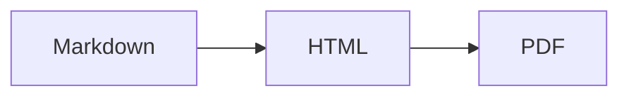

# md-to-print: Because Screen Reading Killed My Eyes


## The Problem With Reading on Screens

I read a lot of markdown. Documentation, notes, LLM output, technical specs. And I'm tired of squinting at screens. My eyes are getting older, and backlights are merciless.

"Just print it," I thought. So I did. And it looked like garbage.

Most markdown-to-PDF tools are designed for web developers who want their docs to look exactly like GitHub renders them. Small fonts. Single column. Infinite scroll mentality. That's great for screens. It's terrible for paper.

## What I Actually Wanted

Paper has different constraints than screens:

1. **Fixed width** - no responsive design, just 8.5 inches
2. **Two eyes** - humans can scan across columns efficiently
3. **No backlight** - contrast matters, but you can go bigger
4. **Physical presence** - a printed doc sits on your desk demanding attention

So I built `md-to-print` with these opinions baked in:

- **2-column layout** like a newspaper or textbook
- **Large fonts** for aging eyes (9.5pt base, generous leading)
- **High contrast** cream paper with dark ink
- **Smart pagination** that doesn't split code blocks or list items mid-page

## The CSS Magic

WeasyPrint gives you real CSS `@page` rules, which most web devs have never touched. Here's the good stuff:

```css
@page {
  size: letter portrait;
  margin: 0.75in 0.6in 0.85in 0.6in;

  @top-center {
    content: string(doc-title);
    font-family: var(--font-mono);
  }

  @bottom-center {
    content: counter(page);
  }
}
```

The `string-set` property lets you pull content from the document into running headers:

```css
h1 {
  string-set: doc-title content();
}
```

So the first `<h1>` becomes your document title in the header. Magic.

## The Real Win: Watch Mode

Converting files manually is for chumps. The real power is in watch mode:

```bash
md-to-print --watch ~/Downloads
```

Now any markdown file that lands in your Downloads folder automatically becomes a PDF. But who wants to remember to start that every time?

## Set It and Forget It: launchd

macOS has a perfectly good service manager that nobody uses. Here's how to make `md-to-print` run forever:

```bash
# Install globally
uv tool install md-to-print

# Create the LaunchAgent
cat > ~/Library/LaunchAgents/com.md-to-print.watch.plist << 'EOF'
<?xml version="1.0" encoding="UTF-8"?>
<!DOCTYPE plist PUBLIC "-//Apple//DTD PLIST 1.0//EN" "http://www.apple.com/DTDs/PropertyList-1.0.dtd">
<plist version="1.0">
<dict>
    <key>Label</key>
    <string>com.md-to-print.watch</string>
    <key>ProgramArguments</key>
    <array>
        <string>/Users/YOU/.local/bin/md-to-print</string>
        <string>--watch</string>
        <string>/Users/YOU/Downloads</string>
    </array>
    <key>RunAtLoad</key>
    <true/>
    <key>KeepAlive</key>
    <true/>
</dict>
</plist>
EOF

# Load it
launchctl load ~/Library/LaunchAgents/com.md-to-print.watch.plist
```

Now it starts on login and restarts if it crashes. You'll never think about it again until you notice PDFs appearing next to your markdown files.

## The Aesthetic

I didn't want generic. The styling uses my personal design system:

- **JetBrains Mono** for headings and code
- **Source Serif 4** for body text
- **Signal Orange** (`#E85D00`) for accents
- Headers prefixed with `//` like code comments

Every `<h2>` looks like this:

```css
h2::before {
  content: "// ";
  color: var(--orange);
}
```

It's opinionated. It's mine. Fork it and make it yours.

## Bonus: Mermaid Diagrams

If you have `mmdc` (mermaid-cli) installed, diagrams Just Work:

~~~markdown

~~~

The diagrams render to SVG and span both columns so they don't get squished.

## Installation

```bash
git clone https://github.com/ddrscott/md-to-print
cd md-to-print
uv sync

# Convert a file
uv run md-to-print document.md

# Watch a directory
uv run md-to-print --watch ./docs/
```

Or install globally and use anywhere:

```bash
uv tool install -e /path/to/md-to-print
md-to-print --watch ~/Downloads
```

## The Takeaway

Stop fighting screens. Some things are better on paper.

`md-to-print` is extremely opinionated because I built it for myself. Large fonts for old eyes. Two columns for efficient reading. Orange accents because I like orange.

If your eyes are tired and your printer is collecting dust, give it a shot. At minimum, you'll have prettier documentation. At best, you'll remember what it's like to read without a backlight.

---

Source: [github.com/ddrscott/md-to-print](https://github.com/ddrscott/md-to-print)
